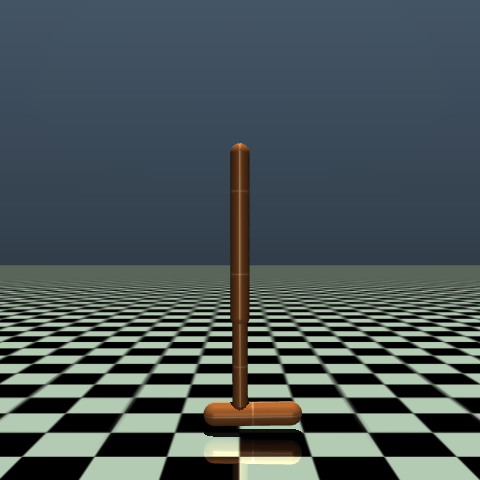
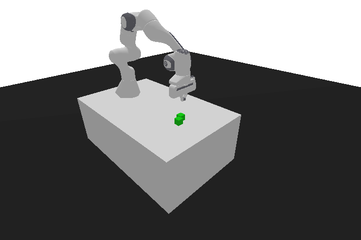

# Policy Gradient Reinforcement Learning and Sim-to-Real Transfer for Robotic Control

[](https://www.python.org/)
[](https://opensource.org/licenses/MIT)
[](https://stable-baselines3.readthedocs.io/)
[](https://gymnasium.farama.org/)

This repository contains the codebase developed for the course project in **Fundamentals of Artificial Intelligence, Machine and Deep Learning (FAIML)** at Politecnico di Torino. 

The project explores reinforcement learning algorithms for continuous robotic control and the challenges of sim-to-real transfer within a controlled sim-to-sim framework. It is divided into two main parts:
1. **From-scratch implementations** of classical policy-gradient and Actor-Critic methods on the Gymnasium MuJoCo `Hopper-v4` environment.
2. **Transfer learning and domain randomization** experiments using Stable-Baselines3 on the `PandaPush-v3` environment, focusing on policy robustness under dynamics mismatch (cube mass variation).

| Hopper Environment | PandaPush Environment |
| :---: | :---: |
|  |  |

---

## Repository Structure

```text
.
├── p1-policy-gradient-methods/
│   ├── agent.py                 # REINFORCE and Actor-Critic agents
│   ├── train.py                 # Training script for Hopper experiments
│   ├── evaluate.py              # Evaluation utilities
│   ├── plot_results.py          # Plot generation from training/evaluation logs
│   ├── results/                 # Saved logs, models, and evaluation outputs
│   └── plots/                   # Generated figures
│
├── p2-advanced-rl-and-transfer/
│   ├── train_ppo.py             # PPO training on PandaPush
│   ├── train_sac.py             # SAC training on PandaPush
│   ├── evaluate.py              # Evaluation script for trained policies
│   ├── rand_wrapper.py          # Source/target and randomization environment wrapper
│   ├── logs/                    # TensorBoard logs
│   └── models/                  # Saved PPO/SAC models
│
├── assets/
│   ├── hopper.gif               # Hopper demo GIF
│   └── pandapush.gif            # PandaPush demo GIF
│
├── requirements.txt             # Python dependencies
├── LICENSE
└── README.md
```

---

## Implemented Methods

- **REINFORCE**: Vanilla policy gradient method using full Monte Carlo trajectory rollouts.
- **REINFORCE with Constant Baseline**: Variance reduction via an action-independent baseline.
- **Actor-Critic (One-Step)**: Bootstrapped temporal-difference updates to reduce variance.
- **n-Step Actor-Critic**: A multi-step variant balancing the bias-variance trade-off in credit assignment.
- **Proximal Policy Optimization (PPO)**: On-policy gradient method using a clipped surrogate objective.
- **Soft Actor-Critic (SAC)**: Off-policy maximum-entropy actor-critic algorithm.
- **Uniform Domain Randomization (UDR)**: Domain randomization sampling simulator parameters from a fixed uniform range.
- **Adaptive/Automatic Domain Randomization (ADR)**: Dynamic range adjustment based on agent performance thresholds.

---

## Tasks and Environments

### 1. Hopper Locomotion (`Hopper-v4`)
Used to evaluate custom-built policy-gradient and Actor-Critic architectures. The agent must learn to coordinate a single-legged robot to hop forward while maintaining balance.

### 2. Panda Push (`PandaPush-v3`)
Used to study advanced policy optimization (PPO vs. SAC) and sim-to-sim transfer robustness. The agent controls a Franka Panda robotic arm tasked with pushing a cube to a target position. 
- **Source Environment (Simulation):** Cube mass is set to $1.0\text{ kg}$.
- **Target Environment ("Real" test):** Cube mass is increased to $5.0\text{ kg}$, introducing a controlled physical discrepancy to evaluate transfer degradation and the stabilizing effects of UDR and ADR.

---

## Installation

To set up the repository and install the necessary dependencies, execute the following commands:

```bash
# Clone the repository
git clone https://github.com/matteosgobba/rl-sim2real-hopper.git
cd rl-sim2real-hopper

# Create and activate a virtual environment
python3 -m venv venv
source venv/bin/activate  # On Windows use: venv\Scripts\activate

# Install dependencies
pip install -r requirements.txt
```

*Note: MuJoCo installation is required for the Hopper environment. Follow the instructions on the [Gymnasium website](https://gymnasium.farama.org/) if you encounter issues.*

---

## Usage

### Part 1: Hopper (Custom Implementations)
To train and evaluate a policy-gradient or Actor-Critic agent on the Hopper environment, use the provided script with appropriate arguments:

```bash
python hopper/train.py --algo reinforce --baseline 20 --episodes 1000 --seed 0
python hopper/train.py --algo actor_critic --ac-variant n_step --n-steps 10 --episodes 1000 --seed 0
```

### Part 2: PandaPush (Transfer and Domain Randomization)
To run baseline trainings, source-to-target transfer, or domain randomization configurations:

```bash
# Train baseline PPO on source environment

python train_ppo_sb3.py \
--env-type source \
--reward-type dense \
--sampling-strategy none \
--timesteps 1000000 \
--seed 0 \
--learning-rate 0.004 \
--ent-coef 0.01

# Train SAC with Uniform Domain Randomization
python train_sac_sb3.py \
--env-type source \
--reward-type dense \
--sampling-strategy udr \
--timesteps 1000000 \
--seed 0 \
--learning-rate 0.0004 \
--ent-coef 0.01 \
--mass-min 1.0 \
--mass-max 6.0

# Train SAC with Adaptive Domain Randomization
python train_sac_sb3.py \
--env-type source \
--reward-type dense \
--sampling-strategy adr \
--timesteps 1000000 \
--seed 0 \
--learning-rate 0.0004 \
--ent-coef 0.01 \
--initial-mass-min 1.0 \
--initial-mass-max 1.5 \
--mass-limit-min 1.0 \
--mass-limit-max 10.0 \
--adr-step 0.25 \
--boundary-prob 0.5
```

---

## Results and Report

The experimental configurations, hyperparameter tuning logs, training curves, and an in-depth comparative analysis of the algorithms are detailed in the project's final report. Evaluation metrics such as success rates, mean returns, and standard deviations across multiple seeds can be visualized using TensorBoard:

```bash
tensorboard --logdir runs/
```

---

## Credits

This project was developed by:
* **Matteo Sgobba** ([matteosgobba](https://github.com/matteosgobba))
* **Federico Di Leo** ([FedericoDiLeo02](https://github.com/FedericoDiLeo02))
* **Martina Mancini** ([marti030](https://github.com/marti030))
* **Paolo Campanini** ([CampaniniP](https://github.com/CampaniniP))

---

## License

This project is licensed under the MIT License.
